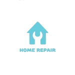
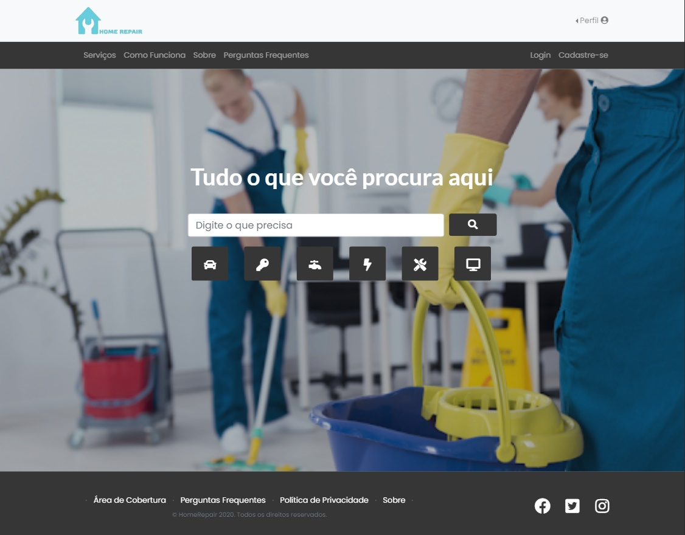
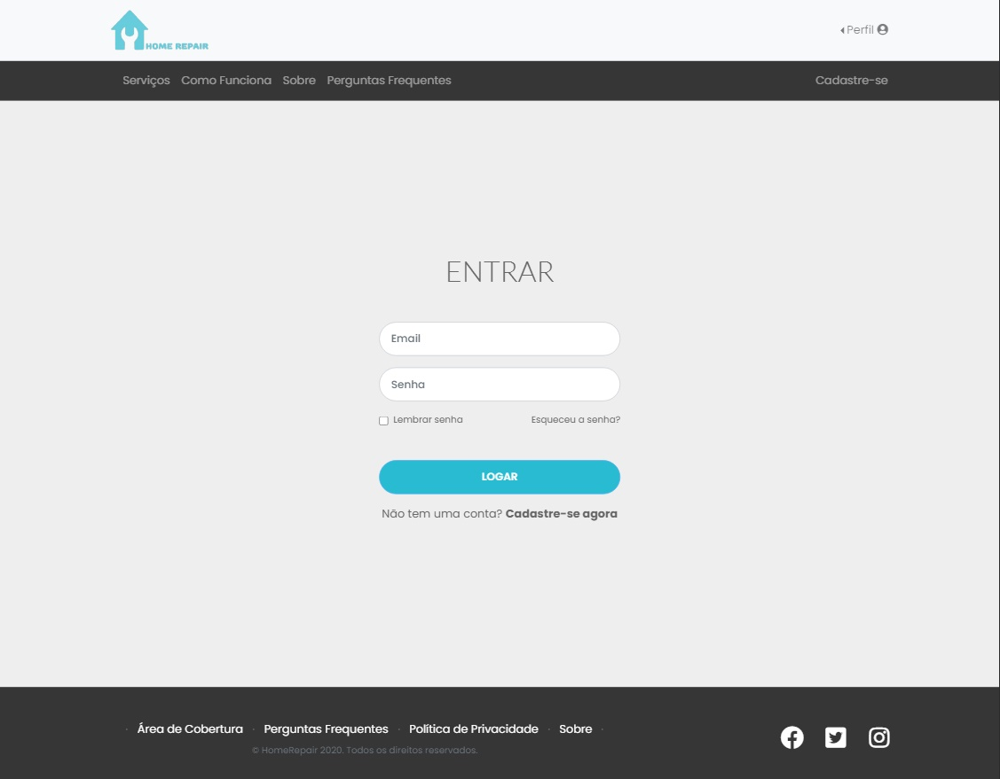
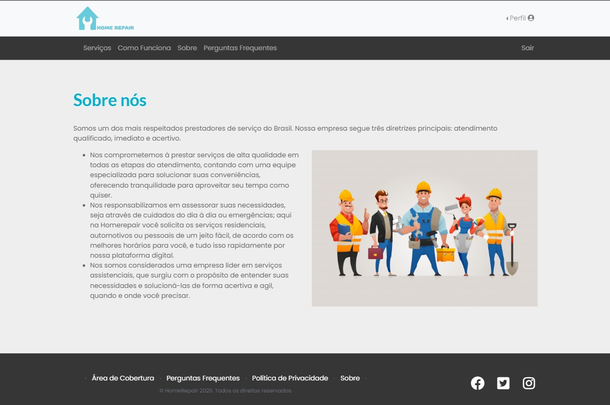
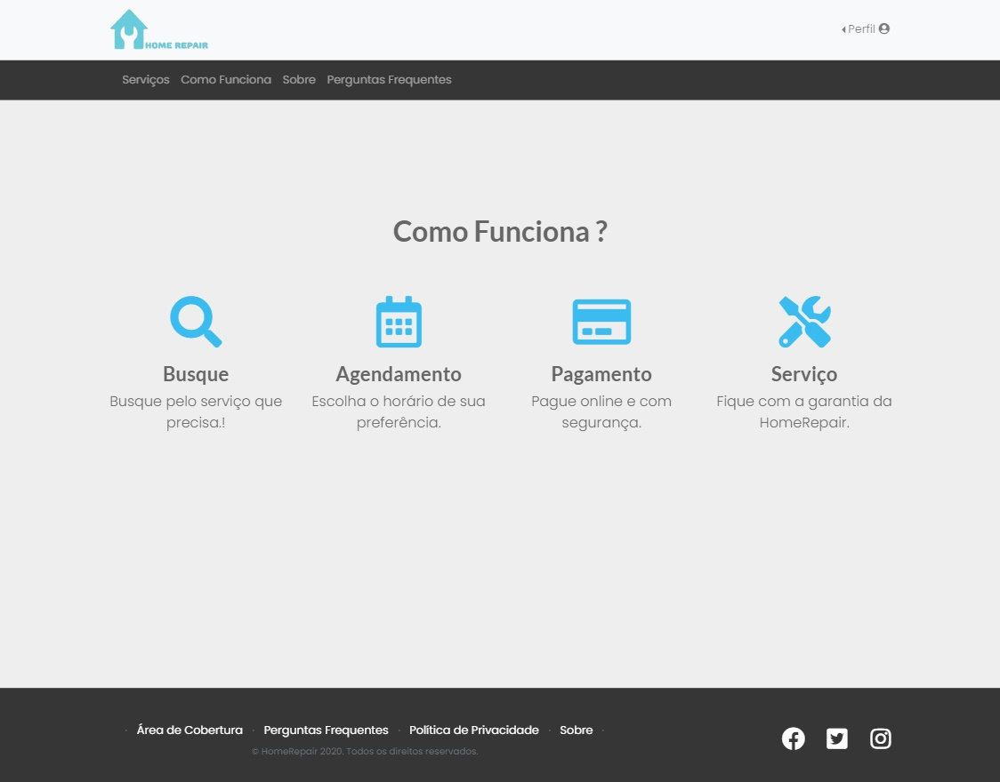
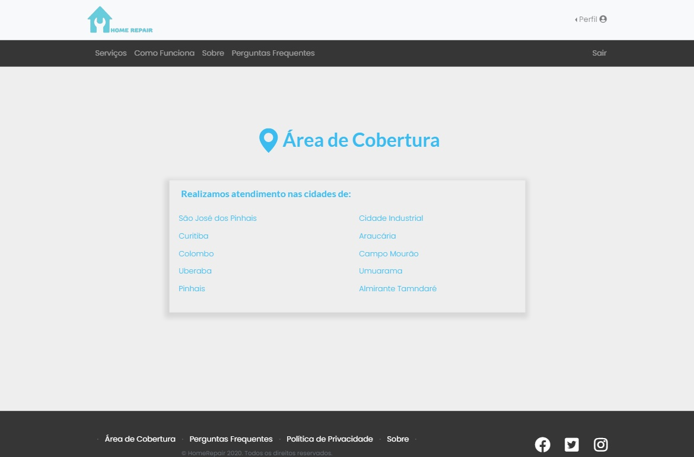

<h1 align="center">
  
</h1>

<h4 align="center">
  <b align="center">Developed with the purpose of scheduling and send service providers and maintenance to customers who are looking for qualified workers and from different areas of activity such as plumbers, mechanics, janitors, electricians and more.</b>
</h4>

 

## :man_technologist: Built with

This project was developed with the following technologies:

-  [HTML5](https://developer.mozilla.org/pt-BR/docs/Web/HTML/HTML5)
-  [CSS3](https://developer.mozilla.org/pt-BR/docs/Archive/CSS3)
-  [BOOTSRAP](https://getbootstrap.com/)
-  [VSCODE](https://code.visualstudio.com/)

## :computer: Preview

## :page_facing_up: License

This project is under the MIT license. 

## :mailbox_with_mail: Get in touch!

[LinkedIn](https://www.linkedin.com/in/pscordeiro/)
